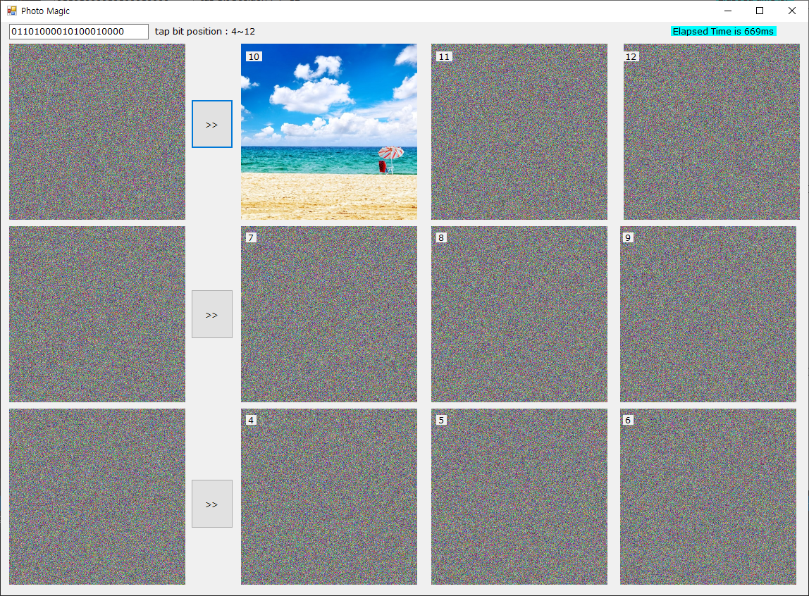

# photo_magic

## Brief
이 프로젝트는 [LFSR(Linear feedback shift register)](https://ko.wikipedia.org/wiki/%EC%84%A0%ED%98%95_%EB%90%98%EB%A8%B9%EC%9E%84_%EC%8B%9C%ED%94%84%ED%8A%B8_%EB%A0%88%EC%A7%80%EC%8A%A4%ED%84%B0) 알고리즘을 이용하여 화상의 암/복호화를 구현한 프로그램입니다.
서울과학기술대학교의 PC기반 제어 프로그래밍 수업의 프로젝트로 제작되었습니다.  

## 장점
1. LFSR 클래스 내에서는 모두 비트연산을 사용하도록 하여 속도를 높였습니다.
2. 상수로 사용하는 변수는 readonly 한정자로 선언하여 안정성을 높였습니다.
3. 반복이 필요한 컨트롤 객체는 모두 객체 배열로 선언하여 가독성을 높였습니다.
4. 반복될 수 있는 변수나 멤버는 따로 저장하여 바로 쓸 수 있게 하였습니다.
5. for문에서는 꼭 필요한 statement만 사용하여 최적화하였습니다.
6. decode 과정을 함수로 만들어 encoded image의 인덱스만으로 바로 사용할 수 있게 하였습니다.
7. CPU에 따라 다르겠지만 대략적인 속도를 비교해볼 수 있도록 elapsed time을 비교할 수 있는 label을 추가하였습니다.